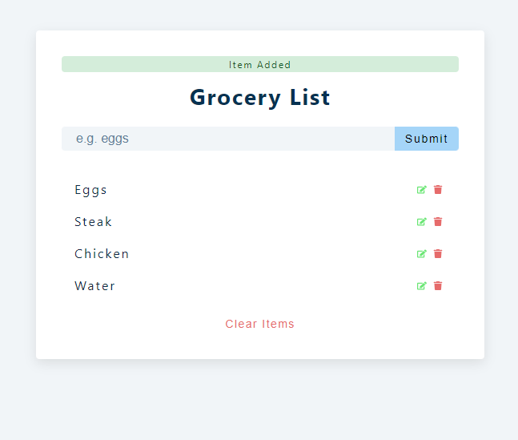

# my-grocery

## Welcome! 👋

This is a grocery list app made with ReactJS.

## Build with ⚙️

This project is built with HTML, CSS and ReactJS.
The app used Local Storage.

## Screenshots 📷

## Link 🔗

[Click Me!](https://my-menu-component.netlify.app/)
